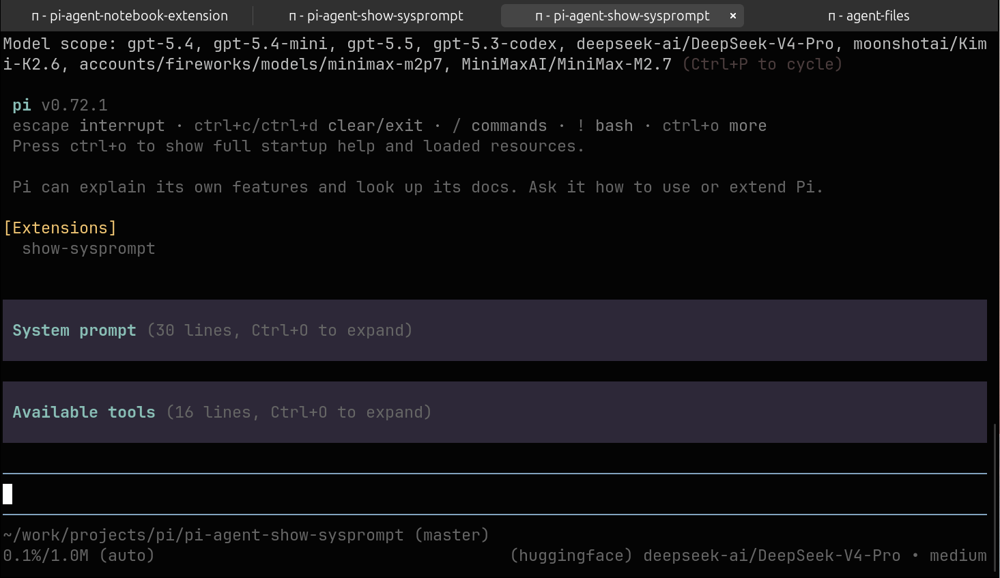

# pi-agent-show-sysprompt

Pi package that shows the rendered system prompt and active tool schemas at startup.

Useful for when you are developing extensions and add modify the tools / system prompt.

## Install

```bash
pi install git:github.com/xl0/pi-agent-show-sysprompt
```
(`-l` for local install into the current dir)



Or load directly:

```bash
pi -e git:github.com/xl0/pi-agent-show-sysprompt
```
